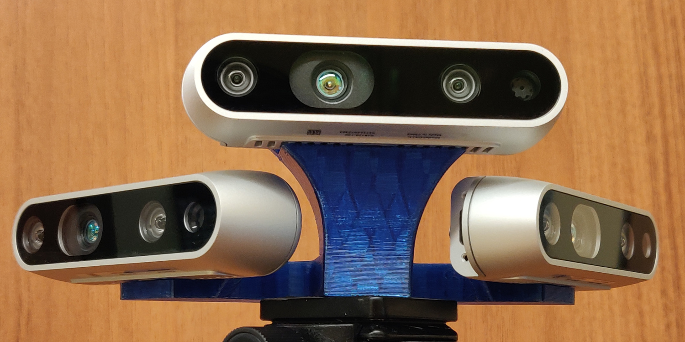

# Multiple-Realsense-D435

<p align="center">
  
</p>

Transform matrixes between main camera link and all other cameras were calculated using [Kalibr](https://github.com/ethz-asl/kalibr/wiki/multiple-camera-calibration) on 1080p RGB video feed. Realsense-ros launch files can be edited to achieve desired resolution parameters. Based on camera setup used, It is neccesary to take into account translation between RGB and depth sensors. Distance between those sensors was measured at 44 milimeters using camera model.

## Calibration

Single calibration (one for each transform) was run with:
```
kalibr_calibrate_cameras --models pinhole-equi pinhole-equi --target aprilgrid.yaml --bag M-R.bag --topics /cam_M/color/image_raw /cam_R/color/image_raw
```

Additionaly, depth sensors were calibrates using RealSense Viewer. On-Chip and Tare calibrations were performed. To do this, firmware update may be needed.

## How to

### Initiate camera feeds

First, we need a way to distinguish between specific D435 cameras. I used serial numbers. They can be found on a sticker at the bottom of the camera or when running roslaunch file. Alternative way to differentiate between cameras is defining serial port numbers. However, I did not test that solution.

Run custom python pyrealsense2 script:
```
rosrun triple_pointcloud triple_pointcloud.py --cam_M_id 947522072464 --cam_R_id 948122072058 --cam_L_id 938422071315
```
Camera id numbers can also be entered directly into code as defaults (lines 45-47). Then, rosrun parameters can be ignored in a command above.

Alternative camera feed via librealsense:
```
roslaunch realsense2_camera rs_aligned_depth.launch camera:=cam_M serial_no:=947522072464 filters:=pointcloud
roslaunch realsense2_camera rs_aligned_depth.launch camera:=cam_L serial_no:=938422071315 filters:=pointcloud
roslaunch realsense2_camera rs_aligned_depth.launch camera:=cam_R serial_no:=948122072058 filters:=pointcloud
```

### Transforms between cameras

3x3 rotation matrix (part of 4x4 transform matrix from Kalibr) was converted to 3 Euler angles [deg] using [this](https://www.andre-gaschler.com/rotationconverter/) tool. Translation values were taken directly from 4x4 Kalibr matrix. The variable sequence is: transX, transY, transZ, rotZ, rotY, rotX. Depending on the application, translation between RGB and depth sensors (44mm) should be added appropriately.

In order to set camera transforms, run the command below. Information is published only once at the beginning of the script, so feel free to run it again if something doesn't work.
```
python src/triple_pointcloud/scripts/set_cams_transforms.py
```

Transforms are loaded from 2 separate .txt files. The variable sequence is: transX, transY, transZ, rotZ, rotY, rotX.

Alternative camera transforms publish via librealsense below. After publishing first transform, exit the script and run another one.
```
python src/realsense-ros/realsense2_camera/scripts/set_cams_transforms.py cam_M_link cam_R_link -0.07713135 -0.13010438 -0.01722759 -50.6754716 2.8649545 2.5538075
python src/realsense-ros/realsense2_camera/scripts/set_cams_transforms.py cam_M_link cam_L_link -0.07713135 0.13010438 -0.01722759 50.6754716 2.8649545 2.5538075 
```

### Rviz

To visualize pointcloud data in rviz, main camera link (in my case cam_M_link) should be set as 'Fixed Frame'. Next, create visualisations by display type 'PointCloud2' and choose topics. Camera transforms should be published after launching rviz.

### Octomap

Before launching octomap, pointclouds need to be published via a single topic. To do that, run:
```
rosrun topic_tools relay PointCloud_R PointCloud_M
rosrun topic_tools relay PointCloud_L PointCloud_M
```

Clone [this](https://github.com/OctoMap/octomap_mapping) repository into your workspace, build it using catkin_make and run:
```
roslaunch octomap_server octomap_mapping.launch frame_id:=cam_M_link cloud_in:=PointCloud_M
```

## Issues

When using D435i without IMU, 2 errors can occur. 'Frame metadata isn't available!' or 'Hardware Notification:Motion Module failure'. It can be fixed by disabling gyro and accel in roslaunch.

## Libraries

- [Intel® RealSense™ SDK 2.0](https://github.com/IntelRealSense/librealsense)
- [ROS Wrapper for Intel® RealSense™ Devices](https://github.com/IntelRealSense/realsense-ros)
- [Kalibr](https://github.com/ethz-asl/kalibr)
- [Octomap](https://github.com/OctoMap/octomap_mapping)
